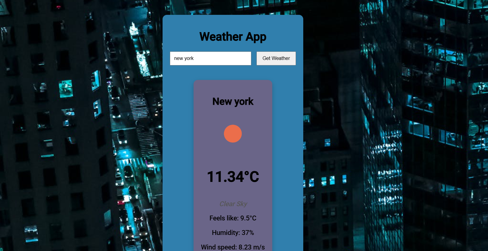

# 🌦️ Weather App

A sleek and responsive weather app built with HTML, CSS, and JavaScript.  
Get current weather details for any city — powered by the OpenWeatherMap API and styled with dynamic visuals.

---

## 🔗 Live Demo

👉 [Click here to view the app live](https://akanna32.github.io/Weather-app/)

> Replace with your actual GitHub Pages link after deploying.

---

## 📸 Screenshot



> Tip: Add a real screenshot named `screenshot.png` in your repo root.

---

## ✨ Features

- Search for current weather by city
- Displays temperature, humidity, wind, and "feels like"
- Weather icons and city background images
- Dynamic background changes based on weather (sunny, rainy, cloudy, etc.)
- Responsive design for desktop and mobile

---

## 🛠️ Built With

- HTML5
- CSS3
- JavaScript (ES6+)
- OpenWeatherMap API
- pexels for city background images

---

## 🚀 Getting Started

To run this project locally:

1. Clone the repo:
   ```bash
   git clone https://github.com/yourusername/weather-app.git
   cd weather-app
